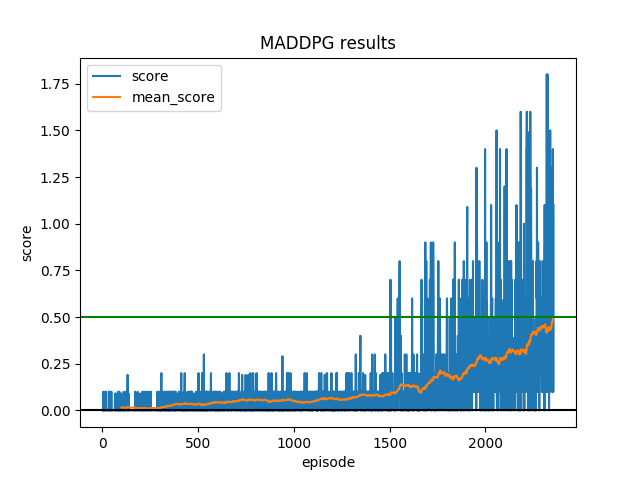

# Udacity Deep Reinforcement Learning Nanodegree
# Project 3: Collaboration and Competition
 
Multi-agent Deep Reinforcement Learning Project.

In this report the algorithms used and findings of the project are reported.
The project was successfully solved in 2355 episodes by a MADDPG (Multi-agent Deep Deterministic Policy Gradient) agent.


### Introduction

This project is based on the [Tennis](https://github.com/Unity-Technologies/ml-agents/blob/master/docs/Learning-Environment-Examples.md#tennis) environment.

![Trained Agent][image1]

In this environment, two agents control rackets to bounce a ball over a net. If an agent hits the ball over the net, it receives a reward of +0.1.  If an agent lets a ball hit the ground or hits the ball out of bounds, it receives a reward of -0.01.  Thus, the goal of each agent is to keep the ball in play.

The observation space consists of 8 variables corresponding to the position and velocity of the ball and racket. Each agent receives its own, local observation.  Two continuous actions are available, corresponding to movement toward (or away from) the net, and jumping. 

The task is episodic, and in order to solve the environment, the agents must get an average score of +0.5 (over 100 consecutive episodes, after taking the maximum over both agents). Specifically,

- After each episode, we add up the rewards that each agent received (without discounting), to get a score for each agent. This yields 2 (potentially different) scores. We then take the maximum of these 2 scores.
- This yields a single **score** for each episode.

The environment is considered solved, when the average (over 100 episodes) of those **scores** is at least +0.5.

Environment Description:
```
Number of Visual Observations (per agent): 0
Vector Observation space type: continuous
Vector Observation space size (per agent): 8
Number of stacked Vector Observation: 3
Vector Action space type: continuous
Vector Action space size (per agent): 2
```

### Learning Algorithm 

#### Basic Approach

Project 2- continuous control was solved using PPO and hence I wanted to try something 
different for this project. Hence, DDPG (specifically MADDPG) was chosen. First, a baisc DDPG
agent was implemented and checked on the previous continuous control environment. After successful verification,
the code was modified for multi agent scenario. After that manual hyperparameter search was done 
to solve the problem statement.

#### Actor-Critic Method
Actor-critic are a combination of policy-based and valued-based methods.
In actor-critic methods:
1. The critic estimates the value function.
2. The actor updates the policy distribution in the direction suggested
by the critic.

Both the actor and critic are generally deep neural networks. The critic measures the goodness of actions
and the actor controls the behaviour of the agent. Actor-critic methods require relatively lesser training samples and
are more stable.


#### [DDPG](https://spinningup.openai.com/en/latest/algorithms/ddpg.html)
 
Deep Deterministic Policy Gradient (DDPG) learns Q-value function and a
policy concurrently. DDPG uses Bellman equation to learn the Q-value function, which 
is then used to learn the policy.
 
**PseudoCode**


#### [Twin Delayed DDPG](https://spinningup.openai.com/en/latest/algorithms/td3.html)

While DDPG can achieve great performance sometimes, it is frequently 
brittle with respect to hyperparameters and other kinds of tuning. 
A common failure mode for DDPG is that the learned Q-function begins 
to dramatically overestimate Q-values, which then leads to the 
policy breaking, because it exploits the errors in the Q-function. 
Twin Delayed DDPG (TD3) is an algorithm which addresses this issue by 
introducing three critical tricks:

Trick One: Clipped Double-Q Learning. TD3 learns two Q-functions instead 
of one (hence “twin”), and uses the smaller of the two Q-values to form the targets in the Bellman error loss functions.

Trick Two: “Delayed” Policy Updates. TD3 updates the policy (and target 
networks) less frequently than the Q-function. The paper recommends one policy update for every two Q-function updates.

Trick Three: Target Policy Smoothing. TD3 adds noise to the target action, 
to make it harder for the policy to exploit Q-function errors by smoothing out Q along changes in action.

In our implementation we would be making use of trick two and trick three.

**PseudoCode**


#### MADDPG

MADDPG or multi-agent deep deterministic policy gradient is a multi-agent extension 
of the popular DDPG RL algorithm. MADDPG is a centralized training and decentralized 
execution algorithm. This means that the agents have no need for any form of explicit
communication after training.
 
In MADDPG, all agents have their own actor network but share a common critic network. This critic network 
takes as input the combined state vectors and action vectors of all agents.

MADDPG training is the same as DDPG, except the fact that instead of training
a single actor, we train multiple actors. 

In our implementation of MADDPG we have used some of the improvements included 
in Twin Delayed DDPG -
 
1. Adding noise to target noise to smooth policy. Uncorrelated Gaussian Noise 
is added to the target actions to allow the actor to learn a smooth policy. 

2. Delayed policy updates. The critic is updated twice as many times as the
actor.

#### Experience Replay 
Experience Replay is a technique of storing previous agent experience and
sampling from these experiences to train a function approximator. Deep Neural 
Networks generally easily overfit current episodes. Once DNN is overfitted, it's 
hard to produce varied experiences. Experience Replay helps to alleviate this problem.
 
Advantages of experience replay:
- Efficient reuse of previous experience to train the agent. Experience replay 
is very useful when it is expensive to gain real-world experience.
- Better convergence behaviour as experience replay reduces correlation
between experiences.
- Increases learning speed with mini-batches.

#### Noise 

To make DDPG policies better and smoother, we add noise to action values 
during training time. In the original DDPG paper it was suggested to use
time-correlated Ornstein-Uhlenbeck noise, but more recent results suggest
that uncorrelated mean-zero Gaussian noise works perfectly well.
In this implementation we have used uncorrelated mean-zero Gaussian noise.

:max_bytes(150000):strip_icc()/bellformula-56b749555f9b5829f8380dc8.jpg)
Here we keep mean = 0

Noise standard deviation is set to a high value at the beginning and is 
gradually decreased to reduce random exploration. This reduction is 
achieved by multiplying by a `std_decay` factor after every episode. 

### Code description

The code consists of the following packages and files:
- main.py: run this file to train or eval model.
- tennis_maddpg: package containing agent and model code.
- tennis_maddpg/maddpg_agent.py: maddpg agent code.
- tennis_maddpg/network: contains actor and critic classes.
- tennis_maddpg/utils.py: contains experience replay and tensor utils.

### Hyperparameters

| Hyperparameter | Value | Description |
| -------------- | ----- | ----------- |
| no_graphics    | true  | Turns off env rendering |
| train_after_every| 10 | No. of steps to take before training |
| gamma | 0.99 | Discount factor |
| minibatch_size | 256 | Size of minibatch |
| steps_per_epoch | 10 | Steps to train per epoch |
| start_steps | 300 | Exploration steps before training |
| polyak | 0.003 | Soft update param |
| gradient_clip | 0.5 | Gradient clipping value |
| device | "cpu" | PyTorch Device |
| seed | 19 | Random seed value |
| buffer_size | 10e5 | Size of Experience Replay |
| std_start | 5.0 | Starting value of std of noise |
| std_decay | 0.999 | noise std decay value |
| max_epsd_len | 10e4 | Length of longest episode allowed |


- Graphics are turned off to accelerate learning. 
- Seed value does not create much difference.
- std_start and std_decay are set such that the noise decreases but doesnt become 
negligible until episode 8000.
- device is set to cpu for local training and gpu for cloud training.
- gradient_clip is set to 0.5 to prevent the policy values from 
saturating to -1 and +1 due to large gradients.

### Network Architecture
 
 For this problem statement simple feedforward fully connected 
 neural networks are used. ReLU is used as the activation function 
 in this architecture as it tends show good convergence performance 
 in practice. 
 
#### Actor Network 

```
DDPGActor(
  (network): Sequential(
    (0): Linear(in_features=24, out_features=128, bias=True)
    (1): ReLU()
    (2): Linear(in_features=128, out_features=128, bias=True)
    (3): ReLU()
    (4): Linear(in_features=128, out_features=64, bias=True)
    (5): ReLU()
    (6): Linear(in_features=64, out_features=2, bias=True)
    (7): Tanh()
  )
)
```
The output of this network is the action vector with values in (-1, 1). 

#### Critic Network
```
DDPGCritic(
    Sequential(
      (0): Linear(in_features=52, out_features=128, bias=True)
      (1): ELU(alpha=1.0)
      (2): Linear(in_features=128, out_features=128, bias=True)
      (3): ELU(alpha=1.0)
      (4): Linear(in_features=128, out_features=1, bias=True)
    )
)
```
The critic network takes as input the combined state and action vector of all agents and 
outputs the Q-value.
In this implementation the action values have been combined at the 
first layer itself as used in the MADDPG lab example.

#### Result



Goal achieved in 2355 episodes.

#### Ideas for future work

- Implement Prioritized experience replay to speed up training. The 
rewards are very sparse in the beginning due to which it takes about 1000
episodes for the agent to really show some capable behaviour.
- Use agent's visual observations(images) to directly train the agent.
- Try new multi agent algorithms like LOLA(Learning with Opponent-Learning Awareness).